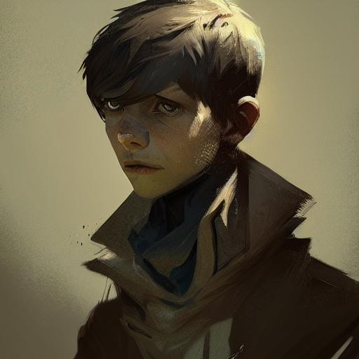

<!-- PROJECT LOGO -->
<br />
<p align="center">
  <h3 align="center">Context2Dialogue</h3>

  <p align="center">
   		基于文本和图像的对话上下文生成器
    <br />
  </p>
</p>

[In English](README_EN.md)


## 引述
### 从对话的观点看待这个工程
给定对话的第一句话，可以通过seq2seq风格的模型获取后续的上下文信息。我发布了两个仓库，名为 [svjack/Daliy-Dialogue](https://github.com/svjack/Daliy-Dialogue) 和 [svjack/GLM-Open-Dialogue](https://github.com/svjack/GLM-Open-Dialogue)，用于这种类型的工作。</br>

它们之间的区别在于，前者是简单的 GPT 或 Bloom seq2seq 结构模型，在没有其他知识或制约的情况下预测后续内容，而后者使用通用语言模型 (GLM) 进行辅助操作，并进行一些重构。</br>

这个项目的重点是实现像 [deepset](https://huggingface.co/deepset) 的 [wikipedia-assistant](https://huggingface.co/spaces/deepset/wikipedia-assistant) 在对话领域的目标。[wikipedia-assistant](https://huggingface.co/spaces/deepset/wikipedia-assistant) 使用 seq2seq 模型生成基于维基百科上下文的长格式答案（通过 faiss 索引进行召回）。答案的有效性由上下文保证，使它们更接近现实。</br>

在 [svjack/Daliy-Dialogue](https://github.com/svjack/Daliy-Dialogue) 中，没有现实保证；在 [svjack/GLM-Open-Dialogue](https://github.com/svjack/GLM-Open-Dialogue) 中，现实保证依赖于预训练的通用语言模型 (GLM)。与以上两个仓库相比，这个项目更接近事实，并且具有相对较快的运行性能（速度）。</br>

尝试并比较使用相似问题作为输入的 [svjack/context-dialogue-chinese-sample-search](https://huggingface.co/spaces/svjack/context-dialogue-chinese-sample-search) 和 [svjack/bloom-gpt-dialogue-chinese-sample-search](https://huggingface.co/spaces/svjack/bloom-gpt-dialogue-chinese-sample-search)，您将了解这个项目与中文领域的第一句话引导对话预测模型之间的区别。<br/>

### 从生成的角度看待这个工程
[svjack/docvqa-gen](https://github.com/svjack/docvqa-gen)  是一个使用文本或文档图像作为输入，并获得问答对作为输出的项目。从生成的角度来看，它是一个“上下文到问答对”的生成器。这个项目是“上下文到对话”场景中的对应项目。<br/>


## HuggingFace 展示
### 使用的相关展示模型 （以 svjack 开头的模型是我训练的）

|Name |HuggingFace 模型链接 | HuggingFace 空间链接 | 语言 | Model 结构 |
|---------|--------|-------|-------|------|
| svjack/summary-dialogue-eng | https://huggingface.co/svjack/summary-dialogue-eng | https://huggingface.co/spaces/svjack/English-Context-Dialogue-Generator | English | T5 |
| svjack/summary-dialogue | https://huggingface.co/svjack/summary-dialogue | https://huggingface.co/spaces/svjack/Chinese-Context-Dialogue-Generator | Chinese | T5 |
| daspartho/prompt-extend | https://huggingface.co/daspartho/prompt-extend | https://huggingface.co/spaces/daspartho/prompt-extend | English | GPT2 |
| svjack/prompt-extend-chinese-gpt | https://huggingface.co/svjack/prompt-extend-chinese-gpt | https://huggingface.co/spaces/svjack/prompt-extend-gpt-chinese | Chinese | GPT2 |
| nlpconnect/vit-gpt2-image-captioning | https://huggingface.co/nlpconnect/vit-gpt2-image-captioning |https://huggingface.co/spaces/SRDdev/Image-Caption | English | VIT X GPT2 |
| YeungNLP/ofa-cn-base-muge-v2 |https://huggingface.co/YeungNLP/ofa-cn-base-muge-v2 ||Chinese| OFA |


<br/>
当您在尝试使用 https://huggingface.co/spaces/svjack/English-Context-Dialogue-Generator 和 https://huggingface.co/spaces/svjack/Chinese-Context-Dialogue-Generator 进行生成时，如果没有得到令人满意的输出，请尝试选择 "do_sample" 选项。您可以尝试通过一种强化学习的方式，采用奖励扩展的方式将该选项包装成样本生成的形式。</br>

### 上面模型生成的数据集展示
|Name |HuggingFace 数据集链接| HuggingFace 空间链接 | 语言 |
|---------|--------|-------|-------|
| svjack/context-dialogue-generate-ds-zh-v1 | https://huggingface.co/datasets/svjack/context-dialogue-generate-ds-zh-v1 | https://huggingface.co/spaces/svjack/context-dialogue-chinese-sample-search | Chinese |


## 安装和结构
参见Huggingface模型卡片

### 安装
```bash
pip install -r requirements.txt
```

### 结构
#### 简单调用一次

* 1 英文文本对话生成器 🦅:

```python
from summary_reverse_pred_eng_native import *

en_context = "The Wisconsin Territorial Centennial half dollar was designed by David Parsons and Benjamin Hawkins and minted by the United States Bureau of the Mint in 1936. The obverse (pictured) depicts a pick axe and lead ore, referring to the lead mining in early Wisconsin"

simple_pred(en_context, do_sample = False)
```

将会输出:
```json
['Have you seen the Wisconsin Territorial Centennial half dollar?',
 'Yeah, it was designed by David Parsons and Benjamin Hawkins.',
 'What is it?',
 "It's a half dollar with a pick axe and lead ore.",
 "That's great!"]
```

</br>

* 2 中文文本对话生成器 🐰:

```python
from summary_reverse_pred_native import *

zh_context = "巴伐利亚号战列舰[a]（德语：SMS Bayern[b]）是德意志帝国海军巴伐利亚级战列舰的主导舰。该舰于1915年2月下水并于1916年7月开始服役，但已来不及参加日德兰海战。它的主炮包括分布在四座双联装炮塔中的八门380毫米口径炮，这比其前身国王级配备的十门305毫米口径炮有了显著改进。[c]舰只连同它的三艘姊妹舰已经形成了公海舰队第四战列分舰队的核心。而这当中仅有一艘，即巴登号完成建造；另外两艘则在第一次世界大战后期，当生产需求被转移至U型潜艇后而撤销。"

simple_pred(zh_context, do_sample = False)
```

将会输出:
```json
['杰克:巴罗利亚号战列舰是哪个国家?',
 '安娜:德意志帝国海军的。它在1915年2月下水,19167开始服役',
 '杰克:该舰的主要装备是什么?',
 '安娜:主炮包括四座双联装炮塔中的八门380毫米口径。',
 '杰克:这比其前身国王级装备的十门305毫米口径炮有了明显改进。',
 '安娜:但只有三艘姊妹舰已经形成公海舰队第四战列分的核心。',
 '杰克:这是为什么?',
 '安娜:它是二战后建造的。']
```

</br>

#### 一些坏结果和修复

```python
from summary_reverse_pred_eng_native import *

en_context = "Cyclone Gabrielle causes widespread damage and flooding across New Zealand."

simple_pred(en_context, do_sample = False)
```

will output:
```json
['file_photo>',
 'Cyclone Gabrielle!',
 "What's that?",
 "It's massive damage and flooding across New Zealand."]
```

</br>

```python
from summary_reverse_pred_native import *

zh_context = '长宗我部本队坚守长濑川，当藤堂军接近时，长宗我部队立即命令部队以铁炮射击[47]，然后进入混战，然后长宗我部进行突击，藤堂高刑、藤堂氏胜和桑名一孝战死[46]，藤堂队先锋被消灭，长宗我部三军进行挟击本队'

simple_pred(zh_context, do_sample = False)
```

will output:
```json
['杰克:长宗我部本队坚守长濑川,当藤堂军接近时,部队立即命令以铁炮射击[47],然后进入混战,进行突击,藤堂高刑、氏胜和桑名一孝战死,藤堂队先锋被消灭,三军挟击。']
```
</br>
</br>
以上两种情况表明，有些句子生成的对话轮预测轮数很少。解决这个问题的一个简单但有效的方法是将 "do_sample" 参数设置为 True，并尝试多次生成。
</br>
</br>
下面是对修复情况的展示

```python
from summary_reverse_pred_eng_native import *

en_context = "Cyclone Gabrielle causes widespread damage and flooding across New Zealand."

df = sample_pred_wrapper(en_context, i2c_obj = i2c_obj)
df["dialogue"].values.tolist()
```

将会生成:
```json
[['What is the weather like in New Zealand?',
  'Cyclone Gabrielle, a massive flooding and hailstorm.',
  "I'm not sure what to make of it",
  'You can talk about it',
  "It's really terrible!"],
 ["What's the weather like in New Zealand?",
  'Cyclone Gabrielle is causing massive damage and flooding.',
  "I guess it's not that bad, but it can be worse than other parts of the country.",
  'But we have to go with a bit of care.'],
 ['Cyclone Gabrielle has broken through New Zealand!',
  "It's a disaster!",
  "I hope it won't be so bad.",
  "But it's really terrible!"],
 ['file_photo>',
  "What's this?",
  'Cyclone Gabrielle!',
  'Where are you?',
  'New Zealand, I think',
  'And what happened?',
  "It's very bad. The roads are so muddy",
  "Why doesn't it rain?",
  'We have to go through these terrible floods',
  "So we're going to be forced to stay in the city"],
 ['How is the weather today?',
  "It's ok, but it's not good",
  'What happened?',
  'Cyclone Gabrielle has spread across New Zealand',
  "I hope it won't be too bad",
  'The worst is already behind us',
  'We need to take care of ourselves']]
```

</br>

```python
from summary_reverse_pred_native import *

zh_context = '长宗我部本队坚守长濑川，当藤堂军接近时，长宗我部队立即命令部队以铁炮射击[47]，然后进入混战，然后长宗我部进行突击，藤堂高刑、藤堂氏胜和桑名一孝战死[46]，藤堂队先锋被消灭，长宗我部三军进行挟击本队'

df = sample_pred_wrapper(zh_context, i2c_obj = ofa_obj)
df["dialogue"].values.tolist()
```

将会生成:
```json
[['杰克:长宗我部本队,你们在哪里?',
  '安娜:我们坚守长濑川,当藤堂军接近时,他们立即命令部队以铁炮射击[47],然后进入混战,进行突击,藤堂高刑、氏胜和桑名一孝战死。',
  '杰克:哦,天哪,这太可怕了!',
  '安娜:还有人在战斗中被切断了线。 长宗我部三军进行挟击本队'],
 ['杰克:长宗我部本队在哪里?',
  '安娜:在长濑川,当藤堂军接近时,我的部队立即命令他们以铁炮射击[47]。然后进入混战,进行突击',
  '杰克:这是什么? 长宗我部:藤堂高刑、氏胜和桑名一孝战死。',
  '安娜:大屠杀是什么时候开始的? 长宗我部三军正在进行挟击本队。'],
 ['杰克:长宗我部三军围攻本队',
  '安娜:为什么?',
  '杰克:我们坚守长濑川,当藤堂军接近时,他们立即命令部队以铁炮射击[47]。然后进入混战,进行突击,藤堂高刑、氏胜和桑名一孝战死',
  '安娜:哦,天哪,这很糟糕!',
  '杰克:大屠杀之后,藤堂队长被解散了。 长宗我部本队:这就是为什么你一直躲在长濑川'],
 ['杰克:长宗我部本队坚守长濑川,当藤堂军接近时,他们将立即命令部队以铁炮射击[47]。然后进入混战,再进行突击,藤堂高刑、氏胜和桑名一孝战死',
  '安娜:长宗我部三军进行挟击本队'],
 ['杰克:你在哪里? 长宗我部三军进行挟击本队',
  '安娜:为什么?',
  '杰克:是的,我们坚守长濑川,当藤堂军接近时,他们立即命令部队以铁炮射击[47]。然后进入混战',
  '安娜:这是哪里?',
  '杰克:藤堂高刑、氏胜和桑名一孝在战斗中死亡。',
  '安娜:这很令人震惊。',
  '杰克:这就是为什么我们的队长被解散原因。',
  '安娜:那我们就等着吧。']]
```

#### 图片上下文对话生成

借助一些出色的图片说明模型，我们可以将上下文模态从文本扩展到图像。例如 [nlpconnect/vit-gpt2-image-captioning](https://huggingface.co/nlpconnect/vit-gpt2-image-captioning ) 在英语中图片到文字生成以及 [YeungNLP/ofa-cn-base-muge-v2](https://huggingface.co/YeungNLP/ofa-cn-base-muge-v2) 在中文图片到文字生成的模型。<br/>
我们可以将根据上下文生成对话的模型从文本扩展到图片。

* 1 英文图片对话生成器 🦅:

<div></div>

</br>


```python
from summary_reverse_pred_eng_native import *

img_path = "pic/black_man.jpeg"

df = sample_pred_wrapper(img_path, i2c_obj = i2c_obj)
df["dialogue"].values.tolist()
```

将会生成:
```json
[['file_photo>', 'A man in black and white', 'Ok'],
 ['Man in a black and white photo', 'Good!', "I'm watching it now"],
 ['file_photo>', 'what is that?', 'man in black and white', 'ok'],
 ['file_photo>', 'a man in a black and white photo', "oh, that's what I saw"],
 ['file_photo>', 'This man in black and white', "He's the best!", 'I know.']]
```

</br>

* 2 中文图片对话生成器 🐰:

<div></div>

</br>


```python
from summary_reverse_pred_native import *

img_path = "pic/cat.jpg"

df = sample_pred_wrapper(img_path, i2c_obj = ofa_obj)
df["dialogue"].values.tolist()
```

将会生成:
```json
[['杰克:你见过可爱的猫咪吗?', '安娜:是的,我见过。', '杰克:太可爱了!'],
 ['杰克:你见过可爱的猫吗?', '安娜:是的,我见过。', '杰克:<file_gif>'],
 ['杰克:嘿,宝贝,你见过可爱的猫咪吗?', '安娜:是的,我见过。', '杰克:哦,对了!', '安娜:<file_gif>'],
 ['杰克:<file_photo>。', '安娜:可爱的猫咪,你见过吗?', '杰克:是的,我非常喜欢它!'],
 ['杰克:你见过可爱的猫咪吗?', '安娜:是的,它很可爱。', '杰克:我看了它们的照片,他们看起来非常可爱。', '安娜:谢!']]
```

</br>

</br>
将 "extend_by_diffusion" 参数设置为 True 将使用扩展模型，这将使生成的文字描述以Stable Diffusion的提示格式变得更加生动。 </br>

一些细节可以从下面的工程获得

[svjack/Stable-Diffusion-Chinese-Extend](https://github.com/svjack/Stable-Diffusion-Chinese-Extend)

</br>
</br>
下面是上面扩展提示的展示

```python
from summary_reverse_pred_eng_native import *

img_path = "pic/black_man.jpeg"

df = sample_pred_wrapper(img_path, i2c_obj = i2c_obj, extend_by_diffusion = True)
df["dialogue"].values.tolist()
```

```json
[['what is this man wearing?',
  'black and white photo by robert mapplethorpe and paolo roversi',
  'file_photo>',
  'hahaha, the color is so vivid that it’s hard to see how dark it really is',
  'yeah, there’s a lot of detail in this picture',
  'I haven’t seen him for ages',
  'just look at his eyes',
  'he looks like he’s having a good day'],
 ['file_photo>',
  "what's that?",
  'a man in a black and white photo style, a black and white photo by ryan church',
  'trending on shutterstock',
  'neo-periptivism',
  'movie still, movie poster, poster art national anthem 3',
  'concert poster, poster art toyism'],
 ['Look at this',
  'file_photo>',
  "What's that?",
  'Lee Jeffries outdoor, 35mm Pentax studio lighting, studio lighting, highly detailed, sharp focus, masterpiece, concept art, trending on artstation, head and shoulders shot, rule of thirds',
  'Wow!'],
 ['file_photo>',
  'What is that?',
  "You're talking about the black and white photo from 1 9 6 8's.",
  'Hahah, how d live in television ransacked at a computer in a basement.',
  "I don't know how to do it.",
  "It's not like you can do anything"],
 ['file_photo>',
  "OMG, that's amazing! I can't believe it's black and white. The colors are so close to the ground...",
  'Yeah, they look really cool in this photo. And what do you think about this?',
  "Well, there's some ultrafine detail, very chiaroscuro lighting, private press, association press photo # film, movie still Proviablize, concert poster, concert poster for the band “Back To The Shielding”",
  'Oh, yeah, nice!']]
```

</br>

```python
from summary_reverse_pred_native import *

img_path = "pic/cat.jpg"

df = sample_pred_wrapper(img_path, i2c_obj = ofa_obj, extend_by_diffusion = True)
df["dialogue"].values.tolist()
```

</br>

将会生成:
```json
[['杰克:嘿,宝贝们,你们看到可爱的猫咪了吗?',
  '安娜:是的,它太可爱了!',
  '杰克:你看过《猫的艺术》吗?',
  '安娜:是的,它非常精彩。',
  '杰克:这是最精彩的部分。 4k. 高分辨率',
  '安娜:那是什么?',
  '杰克:它们在不同的时间有颜色和类型。',
  '安娜:他们看起来真不错。',
  '杰克:这真是太完美了。',
  '安娜:<file_photo>。'],
 ['杰克:你看到可爱的猫咪了吗?',
  '安娜:是的,我看到了。',
  '杰克:她穿着黑色的衣服,站在森林里。',
  '安娜:有一头白色的长发吗?',
  '杰克:<file_photo>。'],
 ['杰克:你看到可爱的猫咪了吗?',
  '安娜:是的,我看到了。',
  '杰克:<file_photo>。',
  '安娜:它是彩色铅笔艺术吗?',
  '杰克:是的,它太可爱了!',
  '安娜:哦,我喜欢它!。',
  '杰克:真的吗?',
  '安娜:是的,它非常有趣!',
  '杰克:这很完美!',
  '安娜:它们很有趣!',
  '杰克:它们的尺寸真的很大,大约3.5厘米。',
  '安娜:看起来真不错!',
  '杰克:你能想象吗?',
  '安娜:我想这是最昂贵的。',
  '杰克:嗯,不完全是。',
  '安娜:谢你,宝贝们!',
  '杰克:在artstation上也很流行。'],
 ['杰克:你见过可爱的猫咪吗?',
  '安娜:哦,我见过。工作室灯火通红,灰色背景,单一身体,没有阴影,混合器,在artstation上趋势,高度详细)彩色',
  '杰克:你喜欢它们吗?',
  '安娜:不,它看起来像一只狗,但是如此可爱。',
  '杰克:是的,我喜欢它们。'],
 ['杰克:嘿,你看到可爱的猫咪了吗?',
  '安娜:是的,我看到了。',
  '杰克:你的数字艺术是什么?',
  '安娜:<file_photo>。',
  '杰克:它看起来真不错!',
  '安娜:它是如此的超现实主义。',
  '杰克:高细节、。',
  '安娜:哇哦!这真是太神奇了',
  '杰克:我们一直在谈论这个系列。',
  '安娜:我想把它变成一个非常有趣的东西。',
  '杰克:但它似乎很有趣。',
  '安娜:但它们很性感。',
  '杰克:就像真正的猫吗?',
  '安娜:是的。',
  '杰克:它的主题是什么?',
  '安娜:文艺复兴风格。',
  '杰克:典型的现代主义。',
  '安娜:像什么?']]
```

## 更多的信息和讨论
将 "do_sample" 设置为 True 可以是对输出进行增强并避免获得无意义输出的一个简单方法，您可以多次尝试并通过设置简单规则找到一些好样本。

### 自训练的一些其它相关模型
|名称 |HuggingFace 模型链接| Task | 语言 | 模型结构 |
|---------|--------|-------|-------|-------|
| svjack/dialogue-summary | https://huggingface.co/svjack/dialogue-summary | Generate summary of a dialogue context | Chinese | T5 |
| svjack/dialogue-summary-fill-characters | https://huggingface.co/svjack/dialogue-summary-fill-characters | Map dialogue character to summary position | Chinese | T5 |
| svjack/vit-gpt-diffusion-zh | https://huggingface.co/svjack/vit-gpt-diffusion-zh | Generate stable diffusion style caption of Image | Chinese | VIT X GPT2 |

<!-- CONTACT -->
## Contact

<!--
Your Name - [@your_twitter](https://twitter.com/your_username) - email@example.com
-->
svjack - https://huggingface.co/svjack - svjackbt@gmail.com - ehangzhou@outlook.com

<!--
Project Link: [https://github.com/your_username/repo_name](https://github.com/your_username/repo_name)
-->
Project Link:[https://github.com/svjack/Context2Dialogue](https://github.com/svjack/Context2Dialogue)


<!-- ACKNOWLEDGEMENTS -->
## Acknowledgements
<!--
* [GitHub Emoji Cheat Sheet](https://www.webpagefx.com/tools/emoji-cheat-sheet)
* [Img Shields](https://shields.io)
* [Choose an Open Source License](https://choosealicense.com)
* [GitHub Pages](https://pages.github.com)
* [Animate.css](https://daneden.github.io/animate.css)
* [Loaders.css](https://connoratherton.com/loaders)
* [Slick Carousel](https://kenwheeler.github.io/slick)
* [Smooth Scroll](https://github.com/cferdinandi/smooth-scroll)
* [Sticky Kit](http://leafo.net/sticky-kit)
* [JVectorMap](http://jvectormap.com)
* [Font Awesome](https://fontawesome.com)
* [Bigscience](https://bigscience.huggingface.co)
* [TextBox](https://github.com/RUCAIBox/TextBox)
* [Langboat](https://huggingface.co/Langboat)
* [uer](https://huggingface.co/uer)
-->
* [deepset-wikipedia-assistant](https://huggingface.co/spaces/deepset/wikipedia-assistant)
* [ClueAI](https://huggingface.co/ClueAI)
* [nlpconnect/vit-gpt2-image-captioning](https://huggingface.co/svjack/prompt-extend-chinese-gpt)
* [YeungNLP/ofa-cn-base-muge-v2](https://huggingface.co/YeungNLP/ofa-cn-base-muge-v2)
* [daspartho/prompt-extend](https://huggingface.co/daspartho/prompt-extend )
* [svjack/Daliy-Dialogue](https://github.com/svjack/Daliy-Dialogue)
* [svjack/GLM-Open-Dialogue](https://github.com/svjack/GLM-Open-Dialogue)
* [svjack/docvqa-gen](https://github.com/svjack/docvqa-gen)
* [svjack/Stable-Diffusion-Chinese-Extend](https://github.com/svjack/Stable-Diffusion-Chinese-Extend)
* [svjack](https://huggingface.co/svjack)
